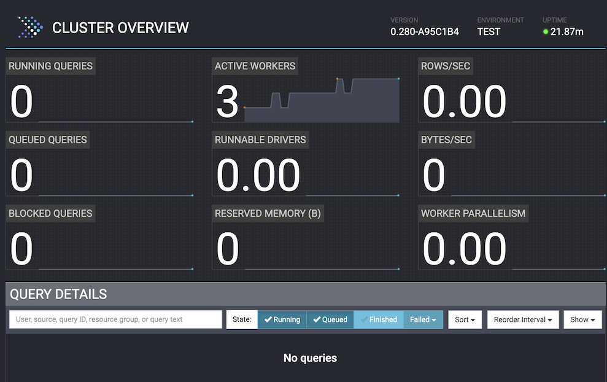

# Getting Started with Presto locally using Docker

## Introduction

This folder contains example files and steps for setting up Presto using Docker.
<br>

1. [Using Docker Desktop](#Running Presto using Docker Desktop)
2. [Using Docker CLI](#Running Presto using Docker CLI)

## Requirements

- [Docker Desktop](https://www.docker.com/products/docker-desktop/) or [Docker CLI](https://docs.docker.com/get-docker/) installed

## Running Presto using Docker Desktop

### Network and container staging
1. Open a Terminal and start by creating a network for the nodes to communicate with each other
```docker network create presto_network```
2. Download a Docker container. For this exercise, use the Presto Sandbox container provided by [Ahana](https://ahana.io/)
```docker pull ahanaio/prestodb-sandbox```

### Setup the Coordinator
```docker run -d -p 8080:8080 -it --net presto_network --name coordinator ahanaio/prestodb-sandbox```
1. Open Docker Desktop and select the **Containers** section on the left
2. You should see the coordinator container running, select the name ```coordinator```
3. You should see the Logs, select the **Terminal** tab
4. Edit the configuration to set this container as a coordinator only, enter the following command
```vi /opt/presto-server/etc/config.properties```
5. Press the ```i``` key to edit the file shown
6. Set the include-scheduler line to false ```node-scheduler.include-coordinator=false```
7. Press ```Esc``` then type ```:wq``` and press ```Enter```
8. Press the circular arrow restart button towards the top right

### Setup 3 Worker Nodes
1. In your terminal run the following commands to spin up 3 worker nodes with different ports
```
docker run -d -p 8081:8081 -it --net presto_network --name worker1 ahanaio/prestodb-sandbox
docker run -d -p 8082:8082 -it --net presto_network --name worker2 ahanaio/prestodb-sandbox
docker run -d -p 8083:8083 -it --net presto_network --name worker3 ahanaio/prestodb-sandbox
```

For each container you must edit the configuraton properties:
   1. Set it to run as a worker node
   2. Inform it where the coordinator is
   3. Set their http port to what you set in the docker run command  

2. Open Docker Desktop and select the **Containers** section on the left
3. You should see the worker containers running, select ```worker1```
4. You should see the Logs, select the **Terminal** tab
5. Enter the following command
   ```vi /opt/presto-server/etc/config.properties```
6. Press the ```i``` key to edit the file shown
7. Set coordinator to false ```coordinator=false```
8. Remove the ```node-scheduler.include-coordinator=true``` line
9. Set http.port to 8081 ```http-server.http.port=8081```
10. Remove the ```discovery-server.enabled=true``` line
11. Set the discovery uri to http://coordinator:8080 ```discovery.uri=http://coordinator:8080```
<br>Your file should now look like this
```
coordinator=false
http-server.http.port=8081
discovery.uri=http://coordinator:8080
```
1. Press ```Esc``` then type ```:wq``` and press ```Enter```
2. Press the circular arrow restart button towards the top right 
3. Select the **Containers** section on the left
4. You should see the worker containers running, select ```worker2```
5. You should see the Logs, select the **Terminal** tab
6. Enter the following command
   ```vi /opt/presto-server/etc/config.properties```
7. Press the ```i``` key to edit the file shown
8. Set coordinator to false ```coordinator=false```
9. Remove the ```node-scheduler.include-coordinator=true``` line
10. Set http.port to 8082 ```http-server.http.port=8082```
11. Remove the ```discovery-server.enabled=true``` line
12. Set the discovery uri to http://coordinator:8080 ```discovery.uri=http://coordinator:8080```
    <br>Your file should now look like this
```
coordinator=false
http-server.http.port=8082
discovery.uri=http://coordinator:8080
```
1. Press ```Esc``` then type ```:wq``` and press ```Enter```
2. Press the circular arrow restart button towards the top right
3. Select the **Containers** section on the left
4. You should see the worker containers running, select ```worker3```
5. You should see the Logs, select the **Terminal** tab
6. Enter the following command
   ```vi /opt/presto-server/etc/config.properties```
7. Press the ```i``` key to edit the file shown
8. Set coordinator to false ```coordinator=false```
9. Remove the ```node-scheduler.include-coordinator=true``` line
10. Set http.port to 8083 ```http-server.http.port=8083```
11. Remove the ```discovery-server.enabled=true``` line
12. Set the discovery uri to http://coordinator:8080 ```discovery.uri=http://coordinator:8080```
    <br>Your file should now look like this
```
coordinator=false
http-server.http.port=8083
discovery.uri=http://coordinator:8080
```
1. Press ```Esc``` then type ```:wq``` and press ```Enter```
2. Press the circular arrow restart button towards the top right
3. Select the **Logs** tab for worker3 and wait for ```======== SERVER STARTED ========``` to appear
4. Check that this is showing on the other two worker nodes
5. Once all worker nodes are back online, open a browser window to ```http://localhost:8080/```
6. You should see 3 active workers ready

*<p align="center">Screenshot of Presto Web UI showing 3 active workers</p>*

Using the steps above you can add as many worker nodes as you need to scale.

## Running Presto using Docker CLI
### Setup the cluster
*coming soon*

## Running Presto using Docker CLI 
The setup using Docker CLI is similar to the setup using Docker Desktop. 

### Network and container staging
1. Open a Terminal and start by creating a network for the nodes to communicate with each other
   ```docker network create presto_network```
2. Download a container, for this exercise use the Presto Sandbox container provided by [Ahana](https://ahana.io/)
   ```docker pull ahanaio/prestodb-sandbox```

### Setup the Coordinator

```docker run -d -p 8080:8080 -it --net presto_network --name coordinator ahanaio/prestodb-sandbox```

1. List the running containers issuing the command ```docker ps```. The ouput should look like this:
```
87dfc138ccf9  ahanaio/prestodb-sandbox "/opt/entrypoint.sh …"   55 minutes ago  Up 23 minutes  0.0.0.0:8080->8080/tcp, :::8080->8080/tcp  coordinator
```
2. To edit the config.properties file for this container to run as a coordinator, login to the container and edit the config.properties file as follows: 
```
docker exec -it coordinator /bin/bash
vi /opt/presto-server/etc/config.properties
```
3. In the vi editor, move the cursor to ```true``` in the line that begins with ``node-scheduler.include``.
   
   Move the cursor to ```true``` in the line that begins with ``node-scheduler.include``.
   
   Type ```cw``` and replace ```true``` with ```false``` ,  ```node-scheduler.include-coordinator=false```
   
   To exit editing mode, press the ```Esc``` key. Then type ```:wq``` and press ```Enter```
   
4. To exit the container by type ```exit``` and press ```Enter```
5. Restart the container ```docker restart coordinator```

### Setup 3 Worker Nodes
1. In your terminal run the following commands to spin up 3 worker nodes with different ports
```
docker run -d -p 8081:8081 -it --net presto_network --name worker1 ahanaio/prestodb-sandbox
docker run -d -p 8082:8082 -it --net presto_network --name worker2 ahanaio/prestodb-sandbox
docker run -d -p 8083:8083 -it --net presto_network --name worker3 ahanaio/prestodb-sandbox
```
If you are running these commands on an Apple Silicon (M1 or M2) system, you may see the following warning for each command: 
```
WARNING: The requested image's platform (linux/amd64) does not match the detected host platform (linux/arm64/v8) and no specific platform was requested
```
followed by the container number. The command has not failed, no action is needed. 


For each container you must edit the configuration properties:
   1. Set it to run as a worker node
   2. Inform it where the coordinator is
   3. Set their http port to what you set in the docker run command  
1. For each worker<n> , n=1,2,3 login to the worker and open the config.properties file in the vi editor
   
```
docker exec -it worker<n> /bin/bash
vi /opt/presto-server/etc/config.properties
```

2. Press the ```i``` key to edit the file 
3. Set coordinator to false ```coordinator=false```
4. Remove the ```node-scheduler.include-coordinator=true``` line
5. Set the port number in the ```http.port``` line to 808<n> ```http-server.http.port=808<n>```
6. Remove the ```discovery-server.enabled=true``` line
7. Set the discovery uri to http://coordinator:8080 ```discovery.uri=http://coordinator:8080```
<br>Your file should now look like this
```
coordinator=false
http-server.http.port=808<n>
discovery.uri=http://coordinator:8080
```
8. To exit editing mode press the ```Esc``` key then type ```:wq``` and press ```Enter```
9. To exit the container by type ```exit``` and press ```Enter```
10. Restart the container ```docker restart worker<n>```
11. Check that all three workers are up and running again ```docker ps```. The output should look like this one
```
cfc933542b4a   ahanaio/prestodb-sandbox   "/opt/entrypoint.sh …"   11 days ago   Up 11 days   8080/tcp, 0.0.0.0:8083->8083/tcp, :::8083->8083/tcp   worker3
4cb6d6976b0b   ahanaio/prestodb-sandbox   "/opt/entrypoint.sh …"   11 days ago   Up 11 days   8080/tcp, 0.0.0.0:8082->8082/tcp, :::8082->8082/tcp   worker2
91e80fce7b20   ahanaio/prestodb-sandbox   "/opt/entrypoint.sh …"   11 days ago   Up 11 days   8080/tcp, 0.0.0.0:8081->8081/tcp, :::8081->8081/tcp   worker1
87dfc138ccf9   ahanaio/prestodb-sandbox   "/opt/entrypoint.sh …"   11 days ago   Up 11 days   0.0.0.0:8080->8080/tcp, :::8080->8080/tcp
```
12. Open a browser window to ```http://localhost:8080/```. You should see 3 active workers ready

*<p align="center">Screenshot of Presto Web UI showing 3 active workers</p>*

Using the steps above you can add as many worker nodes as you need to scale.

## References

- https://github.com/prestodb/presto
- https://www.docker.com/

## Contributing

[//]: # (See the [CONTRIBUTING]&#40;CONTRIBUTING.md&#41; file for how to help out.)

## License

